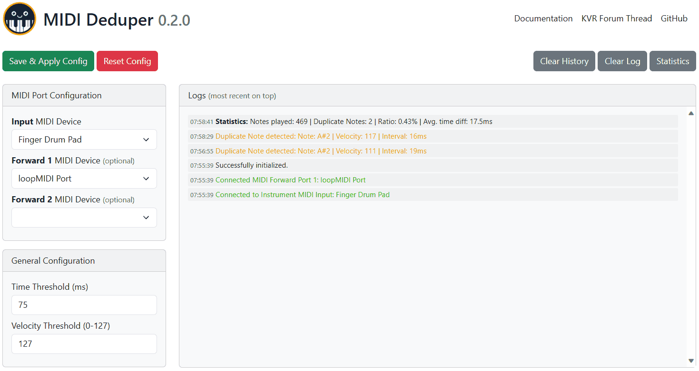

# MIDI Deduper

## Description

This [web app](https://fannon.github.io/midi-deduper/) allows you to de-duplicate accidental MIDI double triggers, as caused e.g. by some MIDI pad controllers.
It runs on any modern [Web MIDI enabled browser](https://caniuse.com/midi). 

Why did I create this project? I have a (finger) drum pad controller, which tends to produce accidental double triggers. 
This is actually not uncommon for pad controllers, especially when the sensitivity is increased / high. 

Such accidental double triggers may be annoying when recording, but will also especially cause problems when playing with [Melodics](https://melodics.com/) or similar software that scores you on correct playing.

## Screenshot

## User Guide

First, you need to have a (virtual) MIDI Loop device, e.g. like [loopMIDI](https://www.tobias-erichsen.de/software/loopmidi.html) for Windows.

In the web app, choose your MIDI Input (the device you play) and then choose the MIDI loop device.
Don't forget to hit the "Save & Apply" button after you made changes.

If you have questions, ideas or issues, feel free to create an [issue](https://github.com/Fannon/midi-deduper/issues) or write in the [KVR forum thread](https://www.kvraudio.com/forum/viewtopic.php?p=8819564).

## Developer Guide

* Install Node.js if not there
* Check out this repository
* Run `npm install`
* Run `npm run build` (to copy over dependencies to webapp)
* Run `npm start` 
